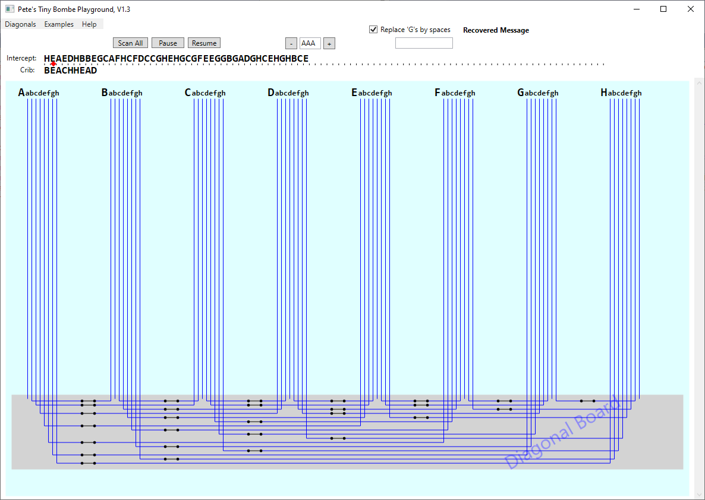
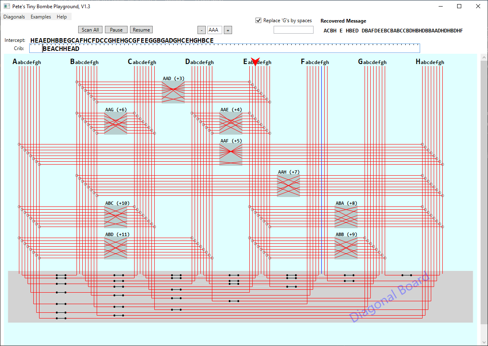
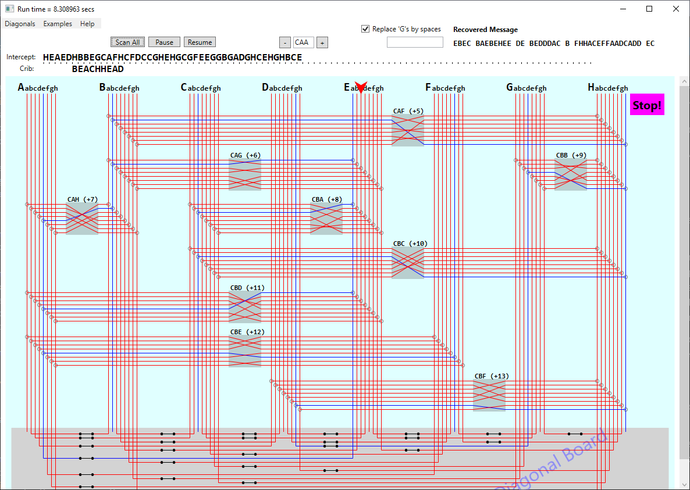
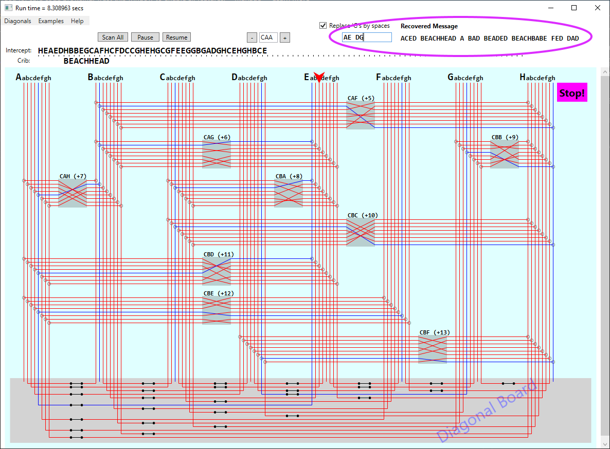

# Quick-Start Guide: the TinyBombe Playground

_Pete Wentworth_    mailto:cspwcspw@gmail.com  

## Resources

The executable for TinyBombe has been zipped up.  You can download it. 
(Click on this link, or, at the GitHub page, right click on 
<a href="TinyBombe.zip"> TinyBombe.zip </a>, and choose `Save Link As`). 

It does not require any installation other than unzipping.
It runs on Windows and needs DotNet 4.5 which is already on most systems.   

Of course if you want the source code and want to build or modify it yourself, 
it is available in the GitHub respository. 

## Overview

Understanding Enigma encryption is helped with nice tools.
There are plenty of simulators.  See Dirk Rijmenants' one
at http://users.telenet.be/d.rijmenants/en/enigmasim.htm. Or
use a browser-based one at https://cryptii.com/pipes/enigma-machine.
Or even build you own paper version: http://wiki.franklinheath.co.uk/index.php/Enigma/Paper_Enigma.

What I found most difficult to wrap my head around was how the 
Bombe machine helped crack intercepted messages.  So the main
contribution here is the TinyBombe application: a small 8-symbol Bombe 
to help deepen insight into why Turing's original Bombe could filter
out wheel settings that led to contradictions. That's the first step.

Each time the Bombe stopped (i.e. could not find any contradictions)
those wheel settings and plugboard hits had to be further explored by hand.
Reducing the number of false positive stops was achieved by the subsequent
addition of Welchman's Diagonal Board.  Why exactly was this extra cross-wiring 
justified, and how much difference did it make in improving the
Bombe's ability to find ctradictions and reject impossible rotor wheel settings?

You should first read Ellsbury.  Particularly,
http://www.ellsbury.com/bombe3.htm where he describes how a small
8-symbol Bombe would be wired up.  This was my starting point.

## Getting Started

When you run TinyBombe you'll start up with a screen like this:

The vertical wires are the bus lines to which scramblers can be attached. There are
8 buses, A,B,C,D,E,F,G,H, each bus with 8 wires labeled a,b,c,d,e,f,g,h.

The diagonal board cross-connects are at the bottom - I've given each wire
its own switch so that you can selectively "disconnect" diagonal board cross-wires.
The first menu item at the top gives some options to include or 
exclude use of the diagonal board. 
 
So we have some intercepted gobbldegook text, and we're led to believe 
that somewhere, for some unknown wheel settings, and some unknown plugboard settings, 
the ciphertext encodes the crib "BEACHHEAD". Can we find where the crib possibly 
aligns to the ciphertext?  And then can we use the correspondence between 
ciphertext and the crib to build a *menu* (the graph of relationships).  

From the menu we can wire up the scramblers to 
to eliminate contradictions.  Our goal is to find some rotor settings and 
plugs so that, when the intercepted message is decrypted, the rest of the resulting 
message makes sense.  (Remember, the German practice in WWII was to change settings
every day at midnight, so once the rotor and plug settings for a single message had 
been cracked, the cipher clerks could read all the intercepted traffic on that 
network for the day without needing to go back to the Bombe.)

The Red error marker between the Intercept and the Crib 
shous that the crib cannot possibly align here
because the Enigma never encoded a letter to itself.   So the first task is to 
insert spaces ahead of the crib to slide 
the crib along beneath the intercepted ciphertext, looking for a  
"viable" alignment. Inserting each space gives more clashes, until our 
first viable crib alignment occurs.  
The program now plugs up some scramblers in preparation for a 
brute-force attack to see if this works
at any of the possible wheel settings. Your display should now look like this:

OK. Plenty of stuff to take note of here. 

1. Nine scramblers have been plugged into the buses. 
Each corresponds to one pair of letters where the crib aligns below the intercepted ciphertext.

2. Each scrambler bridges the buses of its two letters: the first scrambler bridges B to E, 
from the letter in the crib to the letter in the ciphertext. (These are sometimes reversed to
make the layout easier: the Enigma was a symmetric encryption engine, so A <--> E would also 
imply E <--> A).  (The A <--> E notation means A scrambles to E, and vice-versa.)

3. Each scrambler is "offset" in time, or steps, by its position in the crib. Since the start
of the intercept is currently set to be at AAA, that first scramber is +3 steps along. 
By time that scrambling took place, the wheel settings would have clicked over three times,
putting that scrambler into wheel setting AAD.

4. Most of the wires have gone red / live. Once wired up, a voltage is injected onto one of the bus
wires (in this diagram at E.c).  You can click on the voltage arrow to toggle it on/off, or
right click to attach the voltage to any other bus wire instead.  Best practice was to use 
a bus that had the most scramblers plugged into it, so E was chosen here.  

5. Use the + and - buttons near the AAA window settings to single-step the TinyBombe. Each step
moves the rotors in all scramblers, so the cross-connects change in every scrambler, 
and the voltages propagate through different paths.  

6. Each scrambler represents the core wiring of an Enigma machine, and is always 
symmetrical. So at some rotor settings B is cross-wired to D, you'll also find
that D is cross-wired to B.

7. TinyBombe only has 8 symbols on each of its three rotor wheels, 8x8x8 = 512 different 
possible wheel settings.  So click away until you get bored. 
What you are trying to find is some setting of the wheels that "detaches" 
one of the many possible circuits through the sramblers from all others. 
In this case, one of the wires at the test register will remain unlit.  
(Or, if you chose to place the voltage on a wire in that "detached circuit", 
only a single wire will be lit in each bus).

8. OK, time to turn on the automatic scan.   Press the `Scan All` button, and hope 
for some success.  You won't get it yet.  The machine scans the 512 possiblities 
and ends the run with a yellow `END` icon. So, sorry, but there are no wheel 
settings that work with the crib aligned to the intercept at this position.  Try 
a different crib alignment. 

9. Insert another space to slide the crib along, it creates a clash. 
The next space produces the second viable alignment position. Maybe this is the one ...

On the new scan at this alignment, the Bombe finds a possible `Stop` position at rotor 
setting `CAA`. The recovered message (shown near the top right) doesn't make any sense yet, 
but we have discovered a core rotor position.  Once we have a candidate rotor position, 
can we infer some possible plugboard settings that will make sense of the decryption? 

1. Move the voltage source elsewhere, to one of the blue wires that 
is currently unlit. Buses with most scramblers attached were recommended, 
so B.b is a good choice.  Convince yourself that if your
rotor settings have produced two circuits that are mutually isolated from each other, 
you could end up with two situations of interest: either all exept one of the wires 
is lit in the bus you are monitoring, or just one wire is lit.  It will just depend on
where you randomly chose to inject the test voltage.  

2. Now the "aha!" part.  Each wire in the machine represents an hypothesis about how symbols are 
cross-steckered (plugged up). So the wire A.e represents the hypothesis that A is plugged to E. 
When all wires in a bus are lit, or if more than one is lit, 
it represents a contradiction. A cannot be steckered to B and also 
steckered to C at the same time. So Bombe can reject most wheel settings.  
But when the Bombe stops, it gives
us the starting point for the possible plugboard plugs.  

3. From the diagram, in the A bus, any choice of steckering
for A creates contradictions (more than one lit wire) except 
the case if A is steckered to E. Then we look at the other buses,
and find B,C,F,H are not steckered: they map to themselves.  
But D and G are mutually interchanged with a plug.  

So we enter the plugs "AE DG" 
into the machine, hit Enter, and the message is decrypted again:

Success! Apparently our secret intercept decodes to 
"ACED BEACHHEAD A BAD BEADED BEACHBABE FED DAD". This look sufficiently like
a random collection of English Scrabble words to conclude that we've found the settings. 
(It is really quite hard to make decent sentences and words with only 7 or 8 letters,
depending if we want to use the 'G' as a space!)

Notice now that the crib BEACHHEAD is properly aligned under BEACHHEAD in the decrypted 
version of the message. I assume most useful cribs were found near the 
beginning or near the end of the transmission.

## Playground Time

Now that we've cracked the message, and know the rotor setting is CAA, and we know the plugboard, 
what happens if we weaken the crib?  Delete letters from the crib, scan all wheel positions. 
(You can also put wildcard spaces within the crib, e.g. "BEACHH AD")   What you'll find is more
false stops during the scan. The weaker the crib, the less often the machine
can find a contradiction.

Opening all the switches on the diagonal board (use the menu) also weakens the ability of
the Bombe to reject cases.  For this same 
alignment of the BEACHHEAD crib to
the intercepted message, the TinyBombe finds 10 
false stops before it reaches the correct stop `CAA`.  (Use the
`Resume` button to continue scanning after a stop.) 

When all the diagonal switches are open and your wheels stop at a false stop, you'll notice
a few switches where the wires are live on one side, dead on the other.  Click on some of
these switches to toggle them and see if you can clear the false stop condition. 

Each wire in Welchman's diagonal board joins paired partner hypotheses. 
Since the A.e bus wire 
represents the hypothesis that A is steckered to E, then the 
Enigma design means that E must be steckered to A. 
Welchman's diagonal wire accounts 
for this symmetry by connecting A.e to E.a.  

## A Cracking Game

Enter your own cribword, say DEADHEAD, or a phrase ADA BEACH into the Crib text box (left aligned). 
(Internal spaces will be converted to `G` before encryption).  Now right-clck on the `Crib` 
label (to the left of the textbox).
A menu pops up, letting generate your own random puzzle which
contains your crib somewhere.  Now 
attempt to crack it.  If you get stuck, that same menu 
allows you to get a hint (see everything, in fact). 
The hint is shown in the application's title bar.

Enjoy! Send me some feedback or suggestions, 
bug reports, typos, misleading documentation, etc.

_Pete Wentworth_    mailto:cspwcspw@gmail.com 

